# FightHub WFC 
## System zarządzania walkami i szkoleniami organizowanymi przez World Federation of Combat (WFC) 

*Daniłowski Cezary, s25901 16 czerwca 2024, Warszawa* 
*Polsko-Japońska Akademia Technik Komputerowych Modelowanie i Analiza Systemów Informacyjnych* 

### Spis treści

1. [Kontekst i wymagania użytkownika ........................................................................................................ 3](#_page2_x68.00_y91.92)
2. [Diagram przypadków użycia ................................................................................................................... 5](#_page4_x104.00_y93.92)
3. [Diagram klas ............................................................................................................................................ 6](#_page5_x68.00_y70.92)
    3.1. [Analityczny ......................................................................................................................................... 6](#_page5_x68.00_y116.92)
    3.2. [Projektowy ......................................................................................................................................... 7](#_page6_x68.00_y70.92)
4. [Scenariusz przypadku użycia „Wystawienie opinii lekarskiej” ................................................................ 8](#_page7_x68.00_y70.92)
    4.1. [Opis tekstowy ................................................................................................................................. 8](#_page7_x68.00_y138.92)
    4.2. [Diagram aktywności ....................................................................................................................... 9](#_page8_x68.00_y70.92)
5. [Diagram stanu dla klasy „FighterInvolvement” .................................................................................... 10](#_page9_x68.00_y70.92)
6. [Skutki analizy dynamicznej ................................................................................................................... 11](#_page10_x68.00_y70.92)
    6.1. [Metody ............................................................................................................................................ 11](#_page10_x68.00_y150.92)
    6.2. [Atrybuty ........................................................................................................................................... 11](#_page10_x68.00_y386.92)
7. [Projekt graficznego interfejsu użytkownika .......................................................................................... 12](#_page11_x68.00_y91.92)
8. [Decyzje projektowe............................................................................................................................... 14](#_page13_x68.00_y70.92)
    8.1. [ADR 1 – Ekstensja i jej trwałość ........................................................................................................... 14](#_page13_x68.00_y116.92)
    8.2. [ADR 2 – Asocjacja z atrybutem ............................................................................................................ 14](#_page13_x68.00_y301.92)
    8.3. [ADR 3 – Dziedziczenie overlapping ..................................................................................................... 15](#_page14_x68.00_y405.92)
    8.4. [ADR 4 – Dziedziczenie wieloaspektowe .............................................................................................. 17](#_page16_x68.00_y70.92)
    8.5. [ADR 5 – Atrybut powtarzalny .............................................................................................................. 18](#_page17_x68.00_y111.92)
    8.6. [ADR 6 – Mapowanie atrybutów złożonych w modelu relacyjnym ...................................................... 18](#_page17_x68.00_y673.92)
    8.7. [ADR 7 – Mapowanie dziedziczenia w modelu relacyjnym .................................................................. 19](#_page18_x68.00_y250.92)
    8.8. [ADR 8 – Wykorzystane technologie .................................................................................................... 19](#_page18_x68.00_y462.92)
    8.9. [Inne pomniejsze decyzje ..................................................................................................................... 19](#_page18_x68.00_y647.92)

   
### 1. Kontekst i wymagania użytkownika

Pewna organizacja znana pod nazwą World Federation of Combat, w skrócie WFC, zajmuje się organizacją wydarzeń sportowych, a także szkoleń związanych z różnymi sztukami walki. Zwróciła się z prośbą o realizację systemu wspomagającego codzienną pracę i procesy w niej zachodzące. 

System winien umożliwiać dla każdej osoby korzystającej z systemu zapamiętanie jej danych osobowych: imię(imiona), nazwisko, unikalny niezmienny PESEL, data urodzenia, adres, dane kontaktowe (numery telefonów i unikalny w systemie adres e-mail), wiek obliczany na podstawie daty dzisiejszej i daty urodzenia, unikalny login i zaszyfrowane hasło. 

System ma umożliwiać organizację różnego rodzaju wydarzeń, przy czym wydarzenia można podzielić ze względu na rodzaj (turniej, pokaz) i dostępność (prywatne, publiczne). Każde wydarzenie ma cechy: nazwa, data i czas, lokalizacja, termin zapisów, opcjonalny powód odwołania oraz wartość pieniężna wygranej, przy czym dla pokazu do wygranej wchodzi też certyfikat uczestnictwa, a do turnieju dodatkowo do puli wygranej wchodzi pas konkretnego koloru z sztuki walki, którą uczestnik najlepiej opanował (z wyłączeniem sztuk walki, z których ma już najwyższy możliwy pas). Dla publicznego wydarzenia zapamiętywane jest też ilość dostępnych miejsc, a dla wydarzenia prywatnego cena biletu. Każda osoba odpowiedzialna za organizację wydarzenia, dalej zwana Organizatorem ma ustalony budżet narzucony przez WFC, oraz pamiętany jest jej dochód i data zatrudnienia. Organizator wyświetla wydarzenie po jego dodaniu. Poza tym organizator może wyświetlić listę dodanych przez siebie wydarzeń. Z wspomnianej listy może wybrać konkretne wydarzenie, po czym może edytować jego dane, lub też całkowicie je odwołać podając przy tym powód odwołania.  

Organizator, może też organizować bootcampy szkoleniowe, które trenują uczniów w danej sztuce walki w konkretnym pasie. Tzn. uczeń po odbyciu szkolenia zdobywa dany pas z danej sztuki walki. Dla szkolenia zapamiętywana jest jego nazwa, data i czas startu, data i czas zakończenia, pas i sztuka walki. Każdy bootcamp składa się z lekcji, które posiadają informacje o lokalizacji (adres), data i godzina (musi mieć miejsce w czasie trwania bootcampu), temat lekcji, czas trwania w godzinach. Lekcje są posortowane według dat i czasu. System po dodaniu szkolenia, wyświetla je organizatorowi. Organizator może wyświetlić listę dodanych przez siebie szkoleń. Z wspomnianej listy może wybrać konkretną ofertę szkolenia, po czym może ją edytować, dodać dla niej lekcję, wyświetlić jej listę lekcji, a dla tej listy wyświetlić konkretną lekcję i ją odwołać. 

W wydarzeniu może brać udział zawodnik, dla którego należy zapamiętać jego płeć, wagę, wzrost, oraz obliczaną na podstawie wagi klasyfikację wagową, która może przyjąć następujące wartości: musza, kogucia, piórkowa, lekka, półśrednia, średnia, półciężka, ciężka, superciężka. Żeby wziąć udział w wydarzeniu zawodnik musi mieć minimalny wiek, który teraz wynosi 20 lat. Zawodnicy posiadają lub też nie, pasy w różnych sztukach walki 

(biały, żółty, pomarańczowy, zielony, niebieski, purpurowy, brązowy, czarny). Zawodnik zapisując się na wydarzenie musi je uprzednio wyświetlić (wyświetlić informacje o wydarzeniu). Po dokonaniu zapisu system go wyświetla. Zawodnik może wyświetlić swoją listę zapisów na wydarzenie, i z niej wybrać pogląd konkretnego zapisu. Może też wypisać się z wydarzenia do ustalonego terminu zapisów, po tym terminie wypisanie się nie będzie możliwe. Dla zapisu jest pamiętana data zapisu, punkty (już po odbyciu się wydarzenia), zdobyte miejsce (już po odbyciu wydarzenia), status („oczekujący” – przed badaniem, „zaakceptowany” – po badaniu z pozytywną opinią, „odrzucony” – po badaniu z negatywną opinią, „anulowany” – wypisanie się z wydarzenia, „zarchiwizowany” – po odbyciu się wydarzenia). 

System ma umożliwiać wystawianie opinii lekarskich przez licencjonowanych lekarzy na temat zawodnika, który podchodzi do zawodów. Dla lekarzy należy zapamiętać ich numer licencji, oraz dochód płynący z pracy na rzecz WFC. Lekarz może dokonać opinii lekarskiej uprzednio wybierając z listy zapisów zapis konkretnego zawodnika, który będzie brał udział w zawodach. Dla każdej opinii pamiętany jest status, czy zawodnik został dopuszczony przez lekarza do wydarzenia, opis (stan zdrowia, przeciwskazania), data wystawienia opinii. 

Do systemu może zalogować się też kibic, który może zakupić bilet na dane wydarzenie. Kibic ma ulubioną sztukę walki, i ulubionego zawodnika. W ramach zakupu biletu jest pamiętana data jego zakupu, oraz generowany jest numer unikalny w ramach wydarzenia. 

Poza zapisem na wydarzenie zawodnicy mogą też wziąć udział w bootcampie szkoleniowym, Zawodnik, może być mistrzem lub uczniem na bootcampie, nie może być jednocześnie mistrzem i uczniem. Dodatkowo, będąc mistrzem musi posiadać taki sam pas w jakim szkoli bootcamp lub lepszy. Zawodnik zapisuje się na bootcamp uprzednio wybierając go z listy. Po dokonaniu zapisu system go wyświetla. Zawodnik może wyświetlić swoją listę zapisów na szkolenia, a po wyświetleniu konkretnego bootcampu z tej listy, może się z niego wypisać. 

System, ma też umożliwiać comiesięczne generowanie podsumowania finansowego WFC. 

### 2. Diagram przypadków użycia 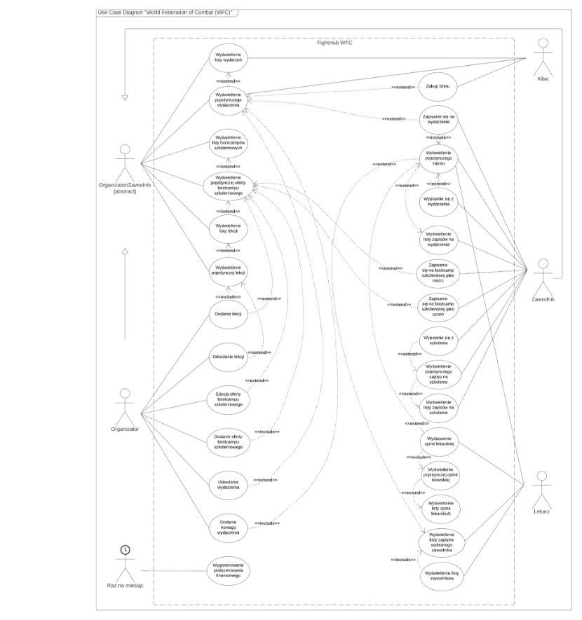
### 3. Diagram klas
#### 3.1. Analityczny 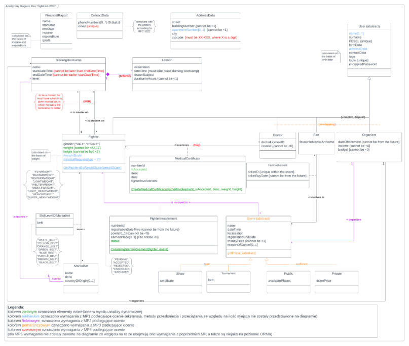
#### 3.2. Projektowy 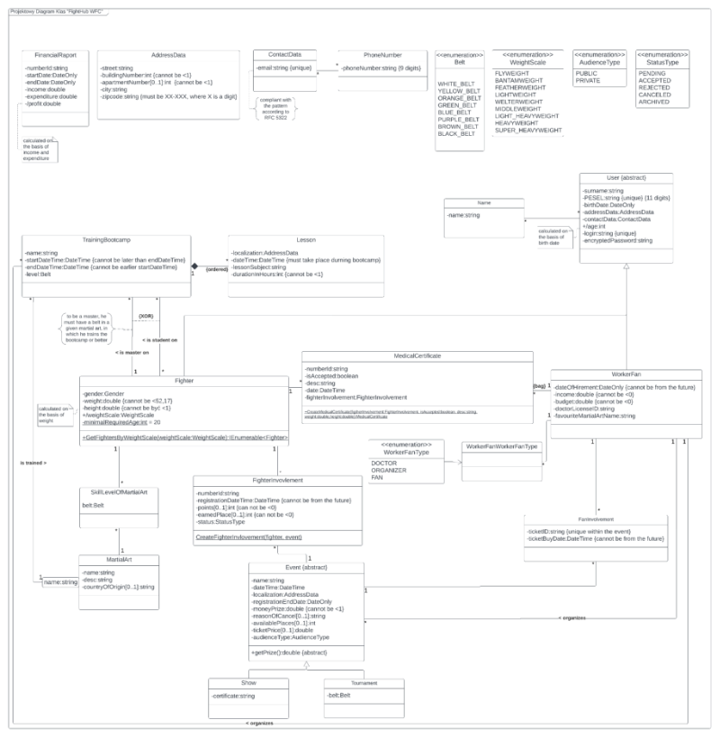
### 4. Scenariusz przypadku użycia „Wystawienie opinii lekarskiej”
#### 4.1. Opis tekstowy 

|**Aktorzy** |Lekarz |
| - | - |
|**Inne przypadki użycia biorące udział** |„Wyświetlenie listy zawodników”, „Wyświetlenie listy zapisów wybranego zawodnika”, „Wyświetlenie pojedynczego zapisu”, „Wyświetlenie pojedynczej opinii lekarskiej” |
|**Warunki początkowe** |Lekarz jest zalogowany. |
|**Główny przepływ zdarzeń** |
1. Aktor uruchamia przypadek użycia „Wyświetlenie listy zawodników”. 

2. System wyświetla listę zawodników, i wybiera domyślnie pustą wartość. 

3. Aktor wybiera kandydata z listy. 

4. Dla wybranego zawodnika system uruchamia przypadek użycia „Wyświetlenie listy zapisów wybranego zawodnika”, aktor wybiera jednego z nich. 

5. System uruchamia przypadek użycia „Wyświetlenie pojedynczego zapisu na wydarzenie”, wyświetlając zapis. 

6. Dla wybranego zapisu, system czeka, aż aktor uruchomi przypadek użycia „Wystawienie opinii lekarskiej”, klikając na przycisk „Wystaw opinię lekarską”. 

7. System wyświetla formularz opinii lekarskiej. Lekarz wypełnia formularz. 

8. System po kliknięciu „Zatwierdź” waliduje wprowadzone dane. 

9. System wyświetla opinię lekarską. 
|
|**Alternatywny przepływ zdarzeń** |
`       `2a.  System wyświetla informację o braku jakichkolwiek zawodników,                przypadek użycia kończy się. 

`       `4a.  Brak jakichkolwiek zapisów dla wybranego zawodnika, przypadek                użycia nie kończy się, system czeka na wybranie innego  

`               `zawodnika. 

`       `8a.  Występują błędy walidacji, system wyświetla stosowne  

`               `komunikaty o niepoprawności danych. 

`               `8aa. Aktor poprawia dane, i po kliknięciu system wraca do kroku                          8. 

`               `8ab. Aktor klika przycisk „Anuluj”, system wraca do kroku 2. 
|
|**Warunek końcowy** |Jest zapamiętana nowa opinia lekarska i jest aktualizowany status zapisu zawodnika w wydarzeniu. |

#### 4.2. Diagram aktywności 

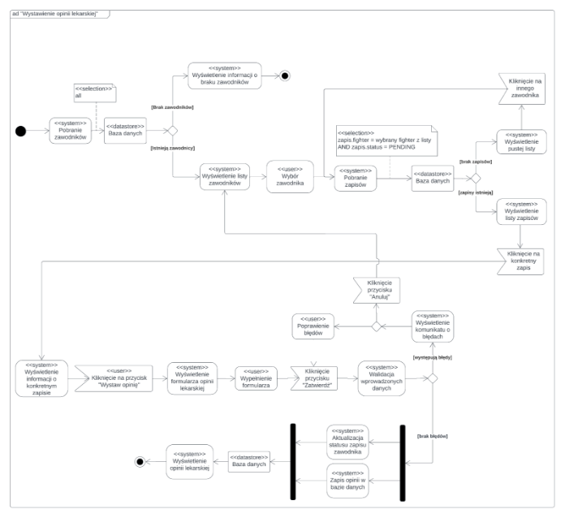

### 5. Diagram stanu dla klasy „FighterInvolvement” ![ref2]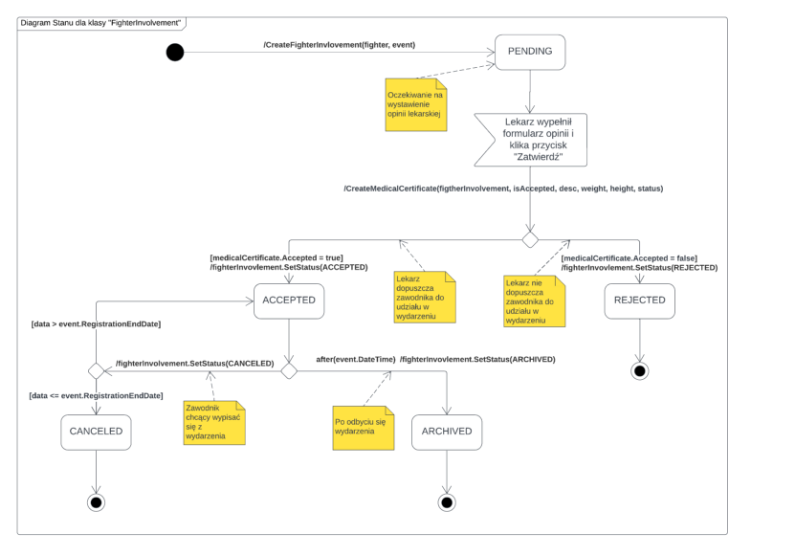
### 6. Skutki analizy dynamicznej ![ref2]

W ramach procesu analizy dynamicznej nakreślono metody i atrybuty potrzebne do przeprowadzenia zaproponowanego przypadku użycia. 

#### 6.1. Metody 

**CreateFighterInvolvement(fighter, event)** 

Tworzy nowy zapis zawodnika w wydarzeniu. **CreateMedicalCertificate(fighterInvolvement, isAccepted, desc, weight, height)** 

Tworzy wstępną nową opinię lekarską. W zależności od pola isAccepted, aktualizuje status fighterInvolvement (true => ACCEPTED, false => REJECTED). IsAccepted decyduje o dopuszczeniu zawodnika do udziału w wydarzeniu. desc – tekstowa treść opinii. Aktualizuje także wagę i wzrost jakie miał zawodnik przed uczestnictwem w wydarzeniu. 

**SetWeight(fighter, newValue) oraz SetHeight(fighter, newValue)**  

Wywoływane wewnątrz metody CreateMedicalCertificate. Aktualizują one wagę i wzrost zawodnika, jakie posiadał przy udziale na wydarzenie. 

**SetStatus( status)** 

Metoda wywoływana przez metodę CreateMedicalCertificate. Aktualizuje status konkretnego zapisu. 

#### 6.2. Atrybuty 

**status –** atrybut w klasie FighterInvolvement biorący udział w przypadku użycia. Reprezentuje status zapisu, gdzie może przyjąć następujące wartości: PENDING, ACCEPTED, REJECTED, ARCHIVED, CANCELED 

**height** – atrybut w klasie Fighter, jest wykorzystywany w przypadku użycia **weight** – tak jak height 

**isAccepted** – atrybut w klasie MedicalCertificate. Lekarz ustawiając go decyduje o dopuszczeniu zawodnika do konkretnego wydarzenia. 

### 7. Projekt graficznego interfejsu użytkownika

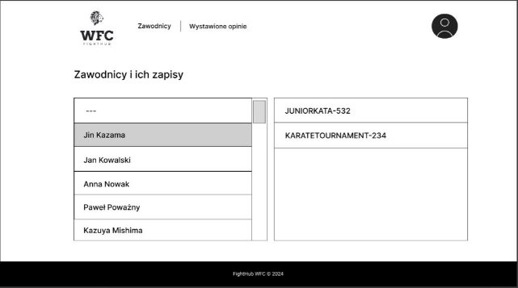

Rys. 7.1 Interfejs lekarza – lista zawodników i ich oczekujących zapisów na wydarzenia. 

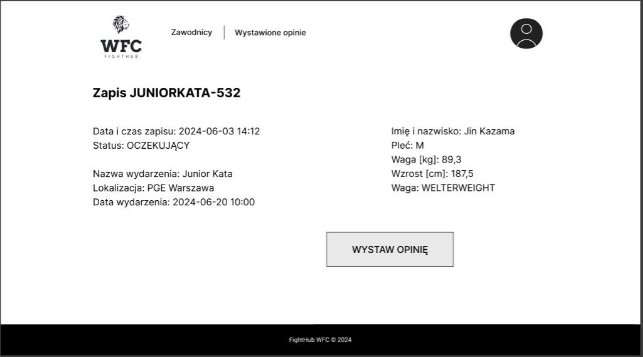

Rys. 7.2 Interfejs lekarza – wyświetlenie pojedynczego zapisu zawodnika. 

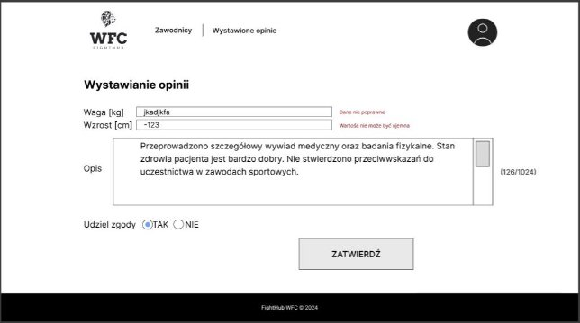

Rys. 7.3 Interfejs lekarza – formularz wystawiania opinii lekarskiej. 

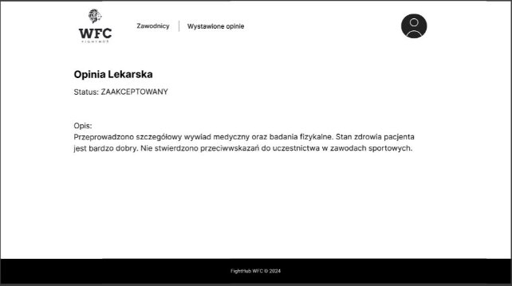

Rys. 7.4 Interfejs lekarza – wyświetlenie pojedynczej opinii lekarskiej. 

### 8. Decyzje projektowe ![ref2]

#### 8.1. ADR 1 – Ekstensja i jej trwałość 

|Kontekst |W ramach projektu wynikła potrzeba przechowywania dużej ilości powiązanych relacjami danych, do których wymagany jest szybki dostęp. W związku z tym konieczne było wybranie odpowiedniego rozwiązania. |
| - | :- |
|Decyzja |Zdecydowano na implementację ekstensji w postaci bazy relacyjnej przy użyciu Microsoft SQL Server |
|Odrzucone alternatywy  |Przechowywanie ekstensji klasy w pliku .xml lub .json |
|Argumenty za wybranym rozwiązaniem |Wydajność, możliwość wykonywania skomplikowanych zapytań, skalowalność, stabilność |
|Kontrargumenty przeciw wybranemu rozwiązaniu |Trudniejsze w implementacji i konfiguracji, nadmiarowość dla niektórych prostych scenariuszy przechowywania danych |
|Decyzja zatwierdzona przez |Daniłowski Cezary |

#### 8.2. ADR 2 – Asocjacja z atrybutem  

|Kontekst |Podczas projektowania systemu zgodnie z zasadami UML napotkano konieczność zamodelowania asocjacji pomiędzy dwoma klasami, posiadającej dodatkowe atrybuty, tj. na Rys. 7.1. Konieczne było wybranie optymalnego rozwiązania |
| - | :- |
|Decyzja |Zdecydowano na implementację tego rodzaju asocjacji jako klasy pośredniej łączącej dwie klasy za pomocą relacji, i posiadającej swoje własne atrybuty, tj. na Rys. 7.2. |
|Odrzucone alternatywy  |Dodatkowe atrybuty wewnątrz jednej z klas będących w relacji |
|Argumenty za wybranym rozwiązaniem |Możliwość rozszerzania klasy o kolejne atrybuty, łatwo zrozumiały model |
|Kontrargumenty przeciw wybranemu rozwiązaniu |Wymóg dodatkowej klasy, potencjalnie bardziej złożone zapytania w bazie danych, drobne skomplikowanie w tworzeniu relacji zwrotnych |
|Decyzja zatwierdzona przez |Daniłowski Cezary |

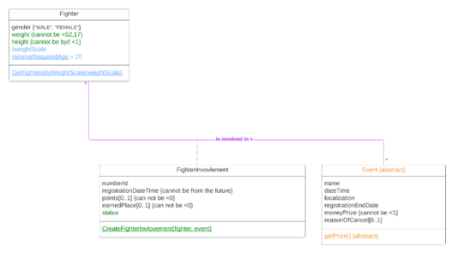

Rys. 7.1 Fragment z analitycznego diagramu klas – przykład asocjacji z atrybutem. 

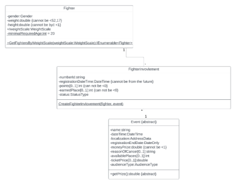

Rys. 7.2 Fragment z projektowego diagramu klas – przykład rozwiązania implementacji asocjacji z atrybutem. 

#### 8.3. ADR 3 – Dziedziczenie overlapping 

|Kontekst |Z systemu mogą korzystać 3 rodzaje użytkowników, którzy mogą mieć funkcjonalności drugiego z 3 rodzajów użytkowników, mowa tu o organizatorze, lekarzu i fanie. Tradycyjne języki programowania nie umożliwiają tego typu dziedziczenia. Rys. 7.3 |
| - | :- |
|Decyzja |Postanowiono rozwiązać ten problem za pomocą jednej klasy WorkerFan, która posiada w sobie atrybut typu ISet<WorkerFanType>, gdzie WorkerFanType to typ wyliczeniowy, przyjmujący wartości DOCTOR, ORGANIZER, FAN – Rys. 7.4. Użytkownik ma dostępne funkcje w zależności od wartości znajdujących się w zbiorze. |
|Odrzucone alternatywy  |Kompozycja klas Organizer, Doctor, Fan (opcjonalne części) wraz z klasą User (całość) |
|Argumenty za wybranym rozwiązaniem |Prostota, zamiast kilku klas jest jedna, co upraszcza strukturę systemu |
|Kontrargumenty przeciw wybranemu rozwiązaniu |Mimo implementacji funkcji innych typów użytkowników, mogą one nigdy nie zostać wykorzystane. Wraz z rozwojem systemu i rozbudowaniem o innych typów użytkowników, możliwe trudności w dziedziczeniu od klasy WorkerFan. |
|Decyzja zatwierdzona przez |Daniłowski Cezary |

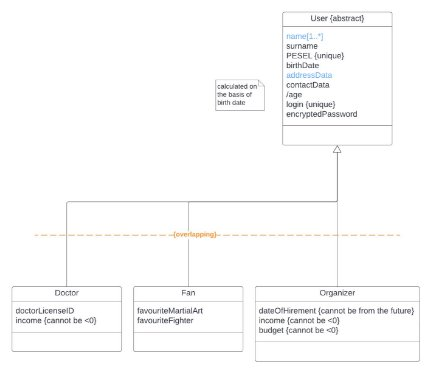

Rys. 7.3 Fragment z analitycznego diagramu klas – dziedziczenie overlapping. 

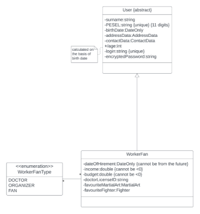

Rys. 7.4 Fragment z projektowego diagramu klas – implementacja dziedziczenia overlapping. 

#### 8.4. ADR 4 – Dziedziczenie wieloaspektowe 

|Kontekst |W systemie modelujemy różne typy wydarzeń, dzielone są ze względu na 2 cechy: typ (Show, Tournament) i odbiór (Public, Private) = Rys. 7.5. Dziedziczą one od klasy abstrakcyjnej. Diedziczenie wieloaspektowe nie jest możliwe w popularnych językach programowaia. Z tego też powodu należało je zaimplementować. |
| - | :- |
|Decyzja |Podjęto decyzję o spłaszczeniu jednego z aspektów, w tym przypadku odbiór. Atrybuty specyficzne dla klas tego aspektu przeniesiono do klasy Event, i dodano atrybut dyskryminujący typu wyliczeniowego, który może przyjąć jedną z dwóch wartości: PUBLIC lub PRIVATE – Rys. 7.6. |
|Odrzucone alternatywy  |Modyfikacja jednego z aspektów w kompozycję |
|Argumenty za wybranym rozwiązaniem |Uproszczona hierarchia dziedziczenia |
|Kontrargumenty przeciw wybranemu rozwiązaniu |Nieco „ukrycie” jednego z aspektów, spowodowane spłaszczeniem do klasy nadrzędnej. Atrybuty jednej z klas spłaszczonego aspektu mogą być nieużywane |
|Decyzja zatwierdzona przez |Daniłowski Cezary |

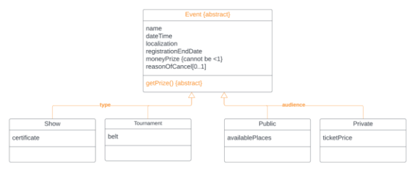

Rys. 7.5 Fragment z analitycznego diagramu klas – dziedziczenie wieloaspektowe. 

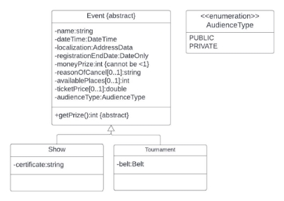

Rys. 7.6 Fragment z projektowego diagramu klas – implementacja dziedziczenia wieloaspektowego. 

#### 8.5. ADR 5 – Atrybut powtarzalny 

|Kontekst |W projekcie pojawia się atrybut powtarzalny, imię i nr telefonu. Potrzebne było rozwiązanie problemu przetrzymywania wartości tych atrybutów niezależnie od ilości ich powtórzeń. |
| - | :- |
|Decyzja |Podjęto decyzję o przeniesieniu tych atrybutów do oddzielnych klas i połączenie ich relacją wiele do wielu. |
|Odrzucone alternatywy  |Wartości w jednej kolumnie oddzielone separatorem  |
|Argumenty za wybranym rozwiązaniem |Dzięki temu rozwiązaniu, ORM Entity Framework stworzy tabelę asocjacyjną co, umożliwia przetrzymywanie wielu wartości atrybutu występującego dla danego obiektu. Rozwiązanie to jest dość proste. |
|Kontrargumenty przeciw wybranemu rozwiązaniu |Dodatkowa tabela, skomplikowanie zapytań |
|Decyzja zatwierdzona przez |Daniłowski Cezary |

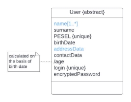

Rys. 7.7 Fragment z analitycznego diagramu klas – przykład atrybutu powtarzalnego, tutaj „name” 

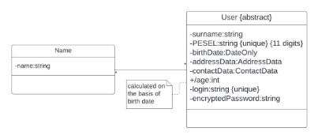

Rys. 7.8 Fragment z projektowego diagramu klas – implementacja atrybutu powtarzalnego. 

#### 8.6. ADR 6 – Mapowanie atrybutów złożonych w modelu relacyjnym 

|Kontekst |W systemie klasy zawierają w sobie atrybuty złożone, które musiały zostać zmapowane na model relacyjny w bazie danych za pomocą ORM. |
| - | :- |
|Decyzja |Postanowiono na spłaszczenie tych atrybutów. Pola znajdujące się w atrybucie złożonym będą bezpośrednio stanowiły kolumny w tabeli |

||reprezentującej klasę, w której ów atrybuty się znajdują. Zostało to zrealizowane za pomocą ORM Entity Framework  |
| :- | :- |
|Odrzucone alternatywy  |Wydzielenie atrybutu złożonego do oddzielnej tabeli i połączenie jej relacją (kluczem obcym) z klasą posiadającą ten atrybut. |
|Argumenty za wybranym rozwiązaniem |Prostsza struktura bazy danych, łatwiejsze zapytania |
|Kontrargumenty przeciw wybranemu rozwiązaniu |Zwiększenie liczby kolumn, oraz możliwa redundancja |
|Decyzja zatwierdzona przez |Daniłowski Cezary |

#### 8.7. ADR 7 – Mapowanie dziedziczenia w modelu relacyjnym 

|Kontekst |Z racji występowania dziedziczenia w systemie, należało w jakiś sposób zmapować je by móc je przetrzymywać w bazie danych w czytelny sposób. |
| - | :- |
|Decyzja |Postanowiono zastosować podejście Table Per Type (TPT) |
|Odrzucone alternatywy  |Tabel Per Hierarchy (TPH), Table Per Concrete Class (TPC) |
|Argumenty za wybranym rozwiązaniem |Atrybuty złożone w klasach zostały spłaszczone za pomocą ORM, co znacznie zwiększa ilość kolumn. Dlatego aby uniknąć jeszcze bardziej zwiększania ich ilości w tabelach implementując inne podejścia postanowiono, aby klasy nadrzędne i pochodne były w osobnych kolumnach, i aby klasy pochodne miały klucze obce odwołujące się do klas nadrzędnych. |
|Kontrargumenty przeciw wybranemu rozwiązaniu |Zwiększenie ilości tabel i pokomplikowanie zapytań |
|Decyzja zatwierdzona przez |Daniłowski Cezary |

#### 8.8 ADR 8 – Wykorzystane technologie 

|Kontekst |Do implementacji tego projektu należało wybrać odpowiednie technologie. |
| - | :- |
|Decyzja |Jako główny język programowania do backendu wykorzystano C# ASP.NET, do frontend’u silnik Blazor, a  maper obiektowo-relacyjny EntityFramework |
|Odrzucone alternatywy  |Spring Boot, Thymeleaf, Hibernate |
|Argumenty za wybranym rozwiązaniem |Spójność technologiczna (ekosystem .Net), konieczność rozwoju w wybranych technologiach - mniej powiązany z projektem |
|Kontrargumenty przeciw wybranemu rozwiązaniu |Problemy z debugowaniem w WebAssembly, |
|Decyzja zatwierdzona przez |Daniłowski Cezary |

#### 8.9. Inne pomniejsze decyzje 
1. Postanowiono nie przedstawiać na diagramach metod typu set i get ze względu na to, iż zajmowało by to dużą ilość miejsca. 
2. W implementacji niektóre złożone metody dotyczące logiki biznesowej zostały ulokowane w oddzielnych klasach - kontrolerach. 
3. Atrybuty opcjonalne w implementacji nie zostały oznaczone adnotacjami @Required w przeciwieństwie do atrybutów wymaganych. 
4. Atrybuty pochodne zostały zaimplementowane w postaci właściwości do odczytu (getter), oznaczono je adnotacją @NotMapped w celu wykluczenia jej z mapowania przez ORM. 
5. Do zmapowania asocjacji wiele-do-wielu wykorzystano tabelę asocjacyjną, podobnie w rodzaju asocjacji z atrybutem. 
6. W kompozycji w części oznaczono klucz obcy do całości adnotacją @Required i uniemożliwiono zmienianie jego wartość ustawiając w kontekście bazy danych przy budowniczym modelu użyto metody ValueGeneratedNever(), która informuje bazę danych o tym, że wartość klucza obcego nie powinna być zmieniania po przypisaniu. Ustawiono także adnotację [Editable(false)] co sprawia, że pole nie jest możliwe do edycji w widokach. 
7. Na diagramie przedstawiono pewne ograniczenia względem atrybutów i relacji. Ograniczenie XOR dla relacji między klasą Fighter, a TrainingBootcamp, gdyż Fighter może brać udział w szkoleniu na dwa sposoby, może być mistrzem, albo uczniem. Logika tego i innych ograniczeń zostały umieszczona w specjalnych customowych adnotacjach. 
8. W celu zachowania unikalności niektórych atrybutów użyto metody w FluentAPI: .HasIndex(e => e.Value).IsUnique();
